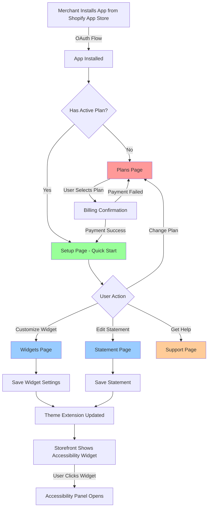

# Shopify Accessibility App - User Flow & Screens Documentation

This document describes the user flow, screens, and API usage for the Shopify Accessibility App. This information is intended for cloning the interface and user flow to another project with a modern tech stack.

## Table of Contents
1. [User Flow Diagram](#user-flow-diagram)
2. [Screens Overview](#screens-overview)
3. [Detailed Screen Information](#detailed-screen-information)
4. [API Endpoints](#api-endpoints)
5. [Data Models](#data-models)

---

## User Flow Diagram



### User Flow Summary

1. **Installation Flow**: User installs app → OAuth → Check billing status → Plans page OR Setup page
2. **Main Application Flow**: Setup → Widgets/Statement/Support → Save changes → Update storefront
3. **Theme Extension**: Loaded on storefront → Displays accessibility widget → Opens accessibility panel

---

## Screens Overview

| Screen | Route | Purpose | Protected |
|--------|-------|---------|-----------|
| **Plans** | `/app/plans` | Billing plan selection & subscription | No (but requires install) |
| **Setup / Quick Start** | `/app/setup` | Getting started guide & welcome | Yes (requires paid plan) |
| **Widgets** | `/app/widgets` | Customize accessibility widget appearance | Yes (requires paid plan) |
| **Statement** | `/app/statement` | Edit accessibility statement content | Yes (requires paid plan) |
| **Support** | `/app/support` | Help docs, videos & contact support | Yes (requires paid plan) |
| **ExitIframe** | `/app/ExitIframe` | Redirect handler for billing flow | Special |

---

## Detailed Screen Information

### 1. Plans Screen (`/app/plans`)

**Purpose**: Display available billing plans and handle subscription flow.

**Screen Content**:
- **Header**: "Choose your plan" title
- **Year End Sale Banner** (conditional, shown during sale periods)
- **Two Plan Cards**:
  - **Monthly Plan**:
    - Price: $6.99/month
    - Features: Enhanced Readability, Visually Pleasing Design, Simplified Navigation, Custom Brand Integration, Premium Support
    - 14-day free trial (or 90 days during sale)
  - **Annual Plan** (highlighted as best value):
    - Price: $5.60/month (billed annually)
    - 20% discount compared to monthly
    - Same features as monthly
    - 14-day free trial (or 90 days during sale)

**Buttons**:
- "Start free trial" / "Downgrade" / "Upgrade" based on current status
- Disabled state shows "Current plan" for active subscription

**User Behavior**:
- If user has active plan → button shows "Current plan" (disabled)
- If user on monthly plan → annual plan shows "Upgrade"
- If user on annual plan → monthly plan shows "Downgrade"
- If no plan → both plans show "Start free trial"

**APIs Used**:
- `GET /app/store?shop={shop}&host={host}` - Fetch store info and billing status
- `POST /app/plans/{planId}?shop={shop}&host={host}` - Request billing plan
  - Plan IDs: `monthly`, `annual`, `year_end_sale_monthly`, `year_end_sale_annual`
  - Returns: `{ confirmUrl: string, paid: boolean }`
- `POST /app/store?shop={shop}&host={host}` - Save language preference

**State Management**:
- `paid` - Current billing status (null = no plan, 'monthly'/'annual' = active)
- `isLoading` - Loading state during API calls
- `requestingMonthly` / `requestingAnnual` - Button loading states
- `currentSetting` - Stores accessibility settings (for language)

---

### 2. Setup / Quick Start Screen (`/app/setup`)

**Purpose**: Welcome page with getting started guide and links to other features.

**Screen Content**:
- **Year End Sale Banner** (conditional)
- **Status Banner** (green or yellow):
  - Shows current accessibility status (enabled/disabled)
  - Links to Shopify Theme Editor
- **Welcome Card**:
  - Introduction text
  - 5-step getting started guide:
    1. Widget customization link
    2. Statement creation link
    3. Help center/FAQ link
    4. Social media links (website, Facebook)
    5. Plan management link
- **Support Card**:
  - "Have questions or need assistance?" text
  - Chat with us button (opens Crisp chat)
  - Email button (mailto:support@sgt-lab.com)
  - Knowledge Base button (links to sgt-lab.com/help)
  - Technical support illustration

**Modal** (shown on first visit):
- Logo
- Auto-sliding popup with feature highlights
- "Close" button

**APIs Used**:
- `GET /app/store?shop={shop}&host={host}` - Fetch store information
- `POST /app/store?shop={shop}&host={host}` - Save settings (language selector)

**State Management**:
- `isStatusOn` - Whether accessibility is enabled
- `activeModal` - Controls help modal visibility
- `currentSetting` - Accessibility settings
- `langSelected` - Language selection ('en' or 'jp')

---

### 3. Widgets Screen (`/app/widgets`)

**Purpose**: Customize the accessibility widget appearance and behavior.

**Screen Content**:
- **Year End Sale Banner** (conditional)
- **Widget Icon Section**:
  - Icon selection grid with various accessibility icons
  - Options: `icon-circle`, `icon-wheelchair`, `icon-eye`, `icon-universal`, etc.
- **Widget Position Section**:
  - 4 position options: top-left, top-right, bottom-left, bottom-right
  - Visual preview of selected position
- **Widget Size Section**:
  - Slider: 24px - 50px
  - Live preview of size
- **Widget Offset Section**:
  - X offset slider: 0 - 100px
  - Y offset slider: 0 - 100px
- **Widget Color Section**:
  - Icon color picker
  - Background color picker
- **Widget Popup Section**:
  - Font selector (11 font options: Lobster, Dancing Script, Lato, Noto Sans, Noto Serif, Nunito, Pacifico, Open Sans, Roboto, Bungee, Bebas Neue)
  - Theme background color picker

**Buttons**:
- Primary action: "Save" (with loading state)

**Live Preview**:
- Accessibility widget is rendered in real-time with current settings
- Changes reflect immediately on the preview widget

**APIs Used**:
- `GET /app/store?shop={shop}&host={host}` - Fetch current widget settings
- `POST /app/store?shop={shop}&host={host}` - Save widget settings
  - Body: `{ app_id, store_id, icon, position, options: { color, size, background_color, offsetX, offsetY, locale, theme_bg_color, font } }`

**State Management**:
- `currentSetting` - Current widget configuration
- `readablerOptions` - Readabler library options
- `readablerStyle` - CSS custom properties for widget styling
- `translateX` / `translateY` - Offset values
- `fontSelected` - Selected font option
- `isSaving` - Save button loading state

---

### 4. Statement Screen (`/app/statement`)

**Purpose**: Create and customize the accessibility statement for the storefront.

**Screen Content**:
- **Year End Sale Banner** (conditional)
- **Rich Text Editor** (Draft.js):
  - Formatting toolbar: Bold, Italic, Underline
  - Lists: Ordered, Unordered
  - Text alignment
  - Link insertion
  - Image insertion
- **Default Statement Content** (pre-loaded):
  - Title: "Accessibility Statement"
  - Sections: Conformance status, Features list, Contact information
  - Can be reset to default via "Reset" button

**Buttons**:
- Primary action: "Save"
- Secondary action: "Reset to default"

**Footer**: Policies links (Privacy Policy, Terms of Service)

**APIs Used**:
- `GET /app/store?shop={shop}&host={host}` - Fetch current statement
- `POST /app/store?shop={shop}&host={host}` - Save statement
  - Body: `{ app_id, store_id, statement: HTML string, options: { ... } }`

**State Management**:
- `editorState` - Draft.js editor state
- `shopData` - Store data including statement content
- `isSaving` - Save button loading state
- `readablerOptions` - Includes `accessibilityStatementHtml`

**Default Statement Content**:
The default statement includes:
- App description and purpose
- WCAG 2.1 AA compliance statement
- Feature list (Font size, Screen Reader, Contrast, Highlight Links, Cursor, Text align, Saturation, Line Height, Letter Spacing, Stop Animations, Mute sounds, Hide Images)
- Contact information (email, chat)

---

### 5. Support Screen (`/app/support`)

**Purpose**: Provide help resources and customer support contacts.

**Screen Content**:
- **Year End Sale Banner** (conditional)
- **Video Tutorial**:
  - Embedded YouTube video (https://www.youtube.com/embed/e0WOkdanoJo)
  - Title: "How to use Accessibility app"
- **Support Options Card**:
  - "Have questions or need assistance?" text
  - Response time note: "respond within 12 - 24 hours via email"
  - Three action buttons:
    1. **Chat with us** - Opens Crisp chat widget
    2. **Email** - mailto:support@sgt-lab.com
    3. **Knowledge Base** - Links to https://sgt-lab.com/help/category/accessibility-faqs/
  - Technical support illustration

**Footer**: Policies links

**APIs Used**:
- `GET /app/store?shop={shop}&host={host}` - Fetch store info (for auth check)
- Note: This page doesn't save data, only displays support resources

**External Services**:
- **Crisp Chat** - Live chat widget (configured with CHAT_SCRIPT_ID)
- **YouTube** - Video embed
- **Knowledge Base** - External help documentation

---

### 6. ExitIframe Screen (`/app/ExitIframe`)

**Purpose**: Handle redirects for billing confirmation outside Shopify Admin iframe.

**Screen Content**:
- Loading spinner with "Redirecting..." message

**Behavior**:
- Parses `redirectUri` query parameter
- Validates hostname matches current domain
- Uses Shopify App Bridge Redirect action to navigate
- Typically used after billing plan confirmation

**APIs Used**:
- None directly (uses Shopify App Bridge Redirect action)

**Query Parameters**:
- `redirectUri` - URL to redirect to after leaving iframe

---

## API Endpoints

### Authentication & Installation

#### `GET /app/auth`
- **Purpose**: Initiate OAuth flow
- **Query Params**: `shop`, `host`, `timestamp`
- **Response**: Redirects to Shopify OAuth page

#### `GET /app/auth/finalize`
- **Purpose**: Complete OAuth flow and receive access token
- **Query Params**: `shop`, `host`, `code`, `timestamp`, `state`
- **Response**: Creates session, redirects to app home

### Store & Settings

#### `GET /app/store`
- **Purpose**: Fetch store information and accessibility settings
- **Auth Required**: Yes (shopify.auth middleware)
- **Query Params**: `shop`, `host`
- **Response**:
```json
{
  "data": {
    "id": 1,
    "shop_url": "example.myshopify.com",
    "name": "Example Store",
    "contact_email": "owner@example.com",
    "paid": "annual",
    "accessibility": {
      "id": 1,
      "status": 1,
      "icon": "icon-circle",
      "position": "bottom-right",
      "options": {
        "color": "#ffffff",
        "size": "24",
        "background_color": "#FA6E0A",
        "offsetX": 10,
        "offsetY": 10,
        "locale": "en",
        "theme_bg_color": "#FA6E0A",
        "font": "8"
      },
      "statement": "<html>...</html>",
      "app_id": 1,
      "store_id": 1
    }
  }
}
```

#### `POST /app/store`
- **Purpose**: Update store accessibility settings
- **Auth Required**: Yes (shopify.auth middleware)
- **Content-Type**: `application/json`
- **Body**:
```json
{
  "app_id": 1,
  "store_id": 1,
  "icon": "icon-circle",
  "position": "bottom-right",
  "options": {
    "color": "#ffffff",
    "size": "24",
    "background_color": "#FA6E0A",
    "offsetX": 10,
    "offsetY": 10,
    "locale": "en",
    "theme_bg_color": "#FA6E0A",
    "font": "8"
  },
  "statement": "<html>...</html>"
}
```
- **Response**: Returns updated store data (same format as GET)

### Billing

#### `POST /app/plans/{planId}`
- **Purpose**: Request subscription to a billing plan
- **Auth Required**: Yes (shopify.auth middleware)
- **Plan IDs**: `monthly`, `annual`, `year_end_sale_monthly`, `year_end_sale_annual`
- **Query Params**: `shop`, `host`
- **Response**:
```json
{
  "confirmUrl": "https://shopify.com/admin/...",
  "paid": false
}
```
- **Behavior**:
  - If store already paid: Returns `{ paid: true }`
  - If payment required: Returns `confirmUrl` for Shopify billing confirmation page

### Theme Extension (Public)

#### `GET /app/accessibilities/{shop}`
- **Purpose**: Public endpoint for theme extension to fetch accessibility settings
- **Auth Required**: No (cors middleware)
- **URL Param**: `shop` - Shop domain
- **Response**:
```json
{
  "data": {
    "status": 1,
    "icon": "icon-circle",
    "position": "bottom-right",
    "options": {
      "color": "#ffffff",
      "size": "24",
      "background_color": "#FA6E0A",
      "offsetX": 10,
      "offsetY": 10,
      "locale": "en",
      "theme_bg_color": "#FA6E0A",
      "font": "8"
    },
    "statement": "<html>...</html>"
  }
}
```

### Health Check

#### `GET /health_check`
- **Purpose**: Application health monitoring
- **Auth Required**: No
- **Response**: Status information

---

## Data Models

### Store Model

```typescript
{
  id: number,
  name: string | null,
  contact_email: string | null,
  shop_id: string | null,          // Shopify shop ID
  shop_url: string | null,         // Shopify shop domain
  country: string | null,
  meta: object | null,
  created_at: string,
  updated_at: string,
  deleted_at: string | null,
  
  // Relationships
  accessibility: Accessibility | null
}
```

### Accessibility Model

```typescript
{
  id: number,
  app_id: number,                  // Current app ID
  store_id: number,                // Foreign key to stores
  status: number,                  // 0 = disabled, 1 = enabled
  icon: string | null,             // Icon key: 'icon-circle', 'icon-wheelchair', etc.
  position: string | null,         // 'top-left', 'top-right', 'bottom-left', 'bottom-right'
  options: {
    color: string,                 // Icon color hex
    size: string,                  // Icon size in px (24-50)
    background_color: string,      // Button background color hex
    offsetX: number | null,        // Horizontal offset 0-100
    offsetY: number | null,        // Vertical offset 0-100
    locale: string,                // 'en' or 'jp'
    theme_bg_color: string,        // Panel background color hex
    font: string                   // Font ID '0'-'10'
  },
  statement: string | null,        // HTML content of accessibility statement
  created_at: string,
  updated_at: string,
  deleted_at: string | null
}
```

---

## Navigation Menu Structure

The app uses Shopify App Bridge NavigationMenu. Menu items are dynamically shown/hidden based on billing status:

```typescript
// When NOT paid (free trial or no plan)
NavigationMenu: []

// When paid (active subscription)
NavigationMenu: [
  {
    label: 'Quick Start',           // or '設定' in Japanese
    destination: '/app/setup'
  },
  {
    label: 'Customize Your Widget', // or 'ウィジェット'
    destination: '/app/widgets'
  },
  {
    label: 'Statement',             // or '声明'
    destination: '/app/statement'
  },
  {
    label: 'Subscription & Plans',  // or 'プラン'
    destination: '/app/plans'
  },
  {
    label: 'Guides & Support',      // or 'サポート'
    destination: '/app/support'
  }
]
```

---

## Key User Interactions

### Authentication Guard
All main screens (except Plans and ExitIframe) check:
1. Is user authenticated with Shopify?
2. Does user have an active billing plan?
3. If no → redirect to `/app/plans`

### Data Persistence Strategy
- **Server Source of Truth**: All settings stored in database
- **Local Caching**: Settings cached in `localStorage` with key `auth_information`
- **Cache Invalidation**: Cache cleared if `time` parameter changes (page reload)
- **Real-time Updates**: Widget preview updates immediately, but saved on button click

### Multi-language Support
- **Supported Languages**: English (en), Japanese (jp)
- **Language Storage**: Saved in `accessibility.options.locale`
- **Scope**: Affects UI labels, messages, and navigation menu
- **Implementation**: Uses `multipleLanguageSelector()` hook

---

## Theme Extension Integration

### Frontend Widget Loading

1. **App Block Injection**: Theme extension injects app block into storefront `<head>`
2. **Asset Loading**: Loads `sgt-accessibility-button.min.js` and `sgt-accessibility-button.min.css`
3. **Configuration Fetch**: Widget fetches settings from `GET /app/accessibilities/{shop}`
4. **Widget Rendering**: Readabler library renders button and panel with fetched settings

### Widget Features

The accessibility widget provides users with:
- **Font size adjustment**
- **Screen reader integration**
- **Contrast adjustment**
- **Link highlighting**
- **Large cursor**
- **Text alignment**
- **Saturation control**
- **Line height adjustment**
- **Letter spacing adjustment**
- **Stop animations**
- **Mute sounds**
- **Hide images**
- **Accessibility statement** (links to stored statement HTML)

---

## External Services & Integrations

### Shopify App Bridge
- **Purpose**: Embed app in Shopify Admin
- **Features**: NavigationMenu, Redirect action, Title updates

### Crisp Chat
- **Purpose**: Customer support chat widget
- **Configuration ID**: `d170d7db-9b6f-4278-9058-c0216e1daeb7`
- **Position**: Dynamically adjusted opposite to accessibility widget position

### Shopify Billing API
- **Plan Types**: Recurring billing (monthly/annual)
- **Trial Period**: 14 days standard (90 days during sale)
- **Confirmation Flow**: Redirects to Shopify billing confirmation, then back to app

---

## Implementation Notes for Modern Tech Stack

When cloning to a modern tech stack (e.g., Remix with Shopify CLI):

1. **Authentication**: Use Shopify's token-based auth or session management
2. **Routing**: Implement same route structure (`/app/setup`, `/app/widgets`, etc.)
3. **Billing**: Use Shopify Admin API's billing endpoints
4. **Database**: Replicate Store and Accessibility models
5. **State Management**: Replace localStorage with proper state management (e.g., React Query, Zustand)
6. **Navigation**: Use Shopify App Bridge or App Router for navigation menu
7. **Theme Extension**: Use Shopify's CLI for theme app extension development

---

## Document Revision History

| Version | Date | Changes |
|---------|------|---------|
| 1.0 | 2025-03-03 | Initial documentation created from existing codebase analysis |
